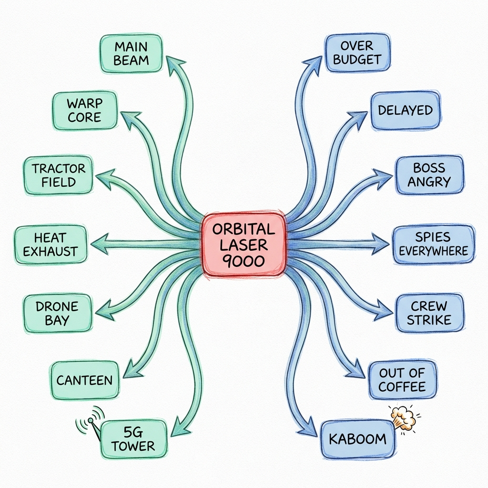

# Excalidraw File Generator 📐✨

If you love Excalidraw as much as I do and wish you could automate your diagram creation, this library is for you.
Now you can generate complex diagrams programmatically—perfect for automating workflows, generating reports, or just having fun with code.

## Why This Library?
Excalidraw is an amazing tool for sketching diagrams and visualizing ideas. However, creating diagrams programmatically isn't fully supported out of the box. This library bridges that gap, allowing you to generate Excalidraw-compatible JSON files with Python code.

## Features 🚀
- Programmatic Diagram Creation: Build diagrams using Python—add shapes, text, images, and more.
- Full Customization: Control position, size, colors, opacity, and styles.
- Image Support: Embed SVG, PNG, and JPEG images directly into your diagrams.
- Group and Frame Elements: Organize your diagrams better.
- Export to Excalidraw: Generate JSON files ready to be imported into Excalidraw.

## Installation 🛠️
pip install excaligen

## Quick Start 🌟
Here's how to create a simple diagram:

```Python
from excaligen.SceneBuilder import SceneBuilder

# Initialize Scene
scene = SceneBuilder()

# Add a rectangle
scene.rectangle('Hello Excalidraw').position(50, 50).size(200, 100).color("Red").background("Pink")

# Add an arrow connecting to it
scene.arrow().bind(scene.rectangle('Start'), scene.rectangle('End'))

# Export to file
scene.save('my_diagram.excalidraw')
```

### What You Can Build
From simple flowcharts to complex data visualizations:

```python
# Code from examples/mind_map_structure.py
# Generate an organic, symmetrical layout
for i in range(-3, 4):
    angle = i * math.pi / 12
    # Calculate positions...
    
    # Bind with a curve for organic flow
    scene.arrow().curve(0, math.pi).bind(center_element, right_node)
    scene.arrow().curve(math.pi, 0).bind(center_element, left_node)
```



## Supported Elements 🎨
- Shapes: Rectangle, Diamond, Ellipse, Line, Arrow
- Text: Customizable fonts, sizes, and alignments
- Images: Supports SVG, PNG, JPEG
- Groups: Organize elements together
- Frames: Encapsulate content within frames

## Customization Options 🧩
Each element can be customized:

- Orientation: `.center(x, y)` or `.position(x, y)`
- Size: `.size(width, height)`
- Color: `.color(stroke_color)`, `.background(fill_color)`
- Stroke Style: `.stroke('solid' | 'dotted' | 'dashed')`
- Thickness: `.thickness(value)`
- Roughness: `.sloppiness('architect' | 'artist' | 'cartoonist')`

Example:
```Python
scene.arrow().bind(node_a, node_b).thickness("bold").stroke("dashed")
```

## Image Handling 🖼️
Add images to your diagrams:
```Python
# Load an SVG image
scene.image().file('path/to/image.svg').fit(200, 200).center(0, 0)
```

## Configuration ⚙️
Customize default settings using `scene.defaults()`:
```Python
scene.defaults().sloppiness("architect").font("Code").color("#333")
```

## Exporting 📤
Export your diagram:
```Python
scene.save('my_diagram.excalidraw')
```
Or just get the JSON string:
```Python
json_data = scene.json()
```

## About the Author ✍️
## About the Author ✍️
Created by **Milan Piskla**. Built with 💜 for connecting code and creativity.
