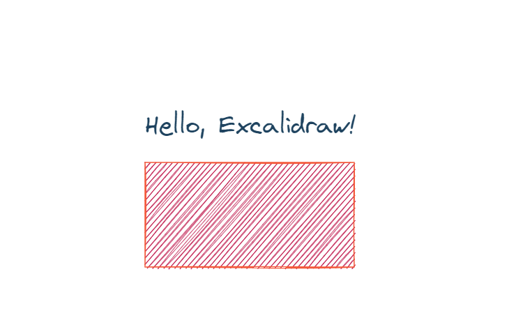

# Excalidraw File Generator 📐✨

If you love Excalidraw as much as I do and wish you could automate your diagram creation, this library is for you.
Now you can generate complex diagrams programmatically—perfect for automating workflows, generating reports, or just having fun with code.

## Why This Library?
Excalidraw is an amazing tool for sketching diagrams and visualizing ideas. However, creating diagrams programmatically isn't fully supported out of the box. This library bridges that gap, allowing you to generate Excalidraw-compatible JSON files with Python code.

## Features 🚀
- Programmatic Diagram Creation: Build diagrams using Python—add shapes, text, images, and more.
- Full Customization: Control position, size, colors, opacity, and styles.
- Image Support: Embed SVG, PNG, and JPEG images directly into your diagrams.
- Group and Frame Elements: Organize your diagrams better.
- Export to Excalidraw: Generate JSON files ready to be imported into Excalidraw.

## Installation 🛠️
Clone the repository:
```
git clone https://github.com/milanpiskla/excaligen.git
cd excaligen
```
Install dependencies:
```
pip install -r requirements.txt
```

## Quick Start 🌟
Here's how to get started:

```Python
from Excaligen import Excaligen

# Initialize Excalidraw instance
xg = Excaligen()

# Add a rectangle
xg.rectangle().position(50, 50).size(200, 100).color("#FF5733").background("#C70039")

# Add text
xg.text().content("Hello, Excalidraw!").position(50, 0).fontsize(24).color("#154360")

# Export to file
xg.save('my_diagram.excalidraw')
```
Open my_diagram.excalidraw in the Excalidraw web app to see your creation!



## Supported Elements 🎨
- Shapes: Rectangle, Diamond, Ellipse, Line, Arrow
- Text: Customizable fonts, sizes, and alignments
- Images: Supports SVG, PNG, JPEG
- Groups: Organize elements together
- Frames: Encapsulate content within frames

## Customization Options 🧩
Each element can be customized:

- Position: .position(x, y)
- Size: .size(width, height)
- Color: .color(stroke_color), .background(fill_color)
- Opacity: .opacity(opacity_percentage)
- Rotation: .rotate(angle_in_degrees)
- Stroke Style: .stroke('solid' | 'dotted' | 'dashed')
- Thickness: .thickness(value)

Example:
```Python
xg.arrow().position(150, 150).size(100, 0).color("#0000FF").thickness(2).stroke("dashed")
```

## Image Handling 🖼️
Add images to your diagrams:
```Python
# Load an SVG image
xg.image().file('path/to/image.svg').position(50, 300).fit(200, 200)

# Load a PNG, JPEG or GIF image
xg.image().file('path/to/image.png').position(300, 300).fit(150, 150)
```

## Configuration ⚙️
Customize default settings using the Config class:
```Python
from config.Config import Config

custom_config = Config({
    "strokeColor": "#000000",
    "backgroundColor": "#FFFFFF",
    "strokeWidth": 2,
})

xg.config(custom_config)
```

## Exporting 📤
Export your diagram:
```Python
xg.save('my_diagram.excalidraw')
```
Or just get the JSON string:
```Python
json_data = xg.json()
```

## About the Author ✍️
My name is Milan Piskla. I'm just coding for fun 😊.


 pip install -e .
 pytest -s

 python -m pytest

 
