## Excaligen Developer Guide
### 📐 Excalidraw File Generation via Python ✨

**Excaligen** bridges the gap between the fantastic diagram editor [Excalidraw](https://excalidraw.com/) and algorithmic visualization.
Excalidraw is well known for its beautiful, hand-drawn aesthetic. 

If you want to generate Excalidraw-compatible files directly from Python, Excaligen is the tool for you. Visualize data structures, automated reports, and complex algorithmic patterns with minimal boilerplate.

## Table of Contents
- [Concepts & The First Sketch](#concepts--the-first-sketch)
- [Shapes & Styles](#shapes--styles)
- [Connectors (Arrows)](#connectors-arrows)
- [Typography (Text)](#typography-text)
- [Lines & Custom Shapes](#lines--custom-shapes)
- [Images](#images)
- [Groups & Frames](#groups--frames)
- [Defaults](#defaults)
- [Algorithmic Generation](#algorithmic-generation)

---
## Concepts & The First Sketch

### The SceneBuilder
The heart of Excaligen is the `SceneBuilder` class. Think of it as your canvas and your toolbox combined.

**Important**: You should always create elements using the `SceneBuilder` methods (like `.rectangle()`, `.arrow()`, etc.). **Do not instantiate element classes directly.** The builder ensures everything is correctly initialized and tied to the diagram.

### Hello World

Create a file named `hello_world.py`:

```python
from excaligen.SceneBuilder import SceneBuilder

scene = SceneBuilder()
scene.text('Hello, World!')
scene.save('hello_world.excalidraw')
```

Executing this script produces a file ready for Excalidraw.


### The Fluent API
Excaligen uses a "fluent" API style. This means you can chain method calls together to configure your elements concisely.

```python
from excaligen.SceneBuilder import SceneBuilder

scene = SceneBuilder()
central_topic = scene.ellipse('Central topic').center(0, 0)
subtopic = scene.rectangle('Subtopic').center(350, 100)
scene.arrow('points to').bind(central_topic, subtopic)

scene.save('binding.excalidraw')
```


The next chapters will explain the API in detail. **We will omit the imports and `scene.save()` calls in examples for brevity.**

---
## Shapes & Styles

Excalidraw is beloved for its hand-drawn feel. Excaligen gives you full programmatic control over this unique aesthetic.

### Core Shapes
Excaligen exposes the core Excalidraw shapes:
- **Rectangle**: `scene.rectangle()`
- **Ellipse**: `scene.ellipse()`
- **Diamond**: `scene.diamond()`

```python
scene.rectangle('Rectangle').center(-150, 0)
scene.ellipse('Ellipse').center(0, 0)
scene.diamond('Diamond').center(150, 0)
```

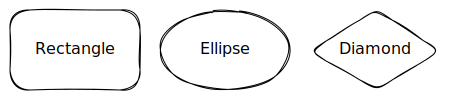

### Positioning
You have flexible control over where elements go.

#### Center
`center(x, y)` places the geometric center of the element at (x, y).
```python
scene.ellipse().center(0, 0)
scene.rectangle().center(0, -120)
scene.diamond().center(150, 0)
```


#### Position
`position(x, y)` places the top-left corner of the element's bounding box at (x, y).
```python
scene.rectangle('Rectangle 1').position(0, 0)
scene.rectangle('Rectangle 2').position(150, 0)
scene.rectangle('Rectangle 3').position(0, 120)
```
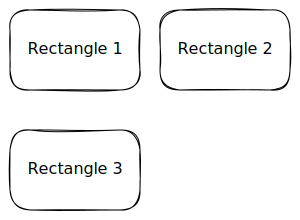

#### Orbit / Polar Coordinates
What if we want to place several elements around a central point? The `orbit()` method allows you to do that.
```Python
RADIUS = 150
SUBTOPICS = 6

scene = SceneBuilder()
central_topic = scene.ellipse('Central topic').center(0, 0)
for i in range(SUBTOPICS):
    angle = i * 2 * math.pi / SUBTOPICS
    scene.rectangle(f'Subtopic {i}').orbit(central_topic, RADIUS, angle)

scene.save('sandbox.excalidraw')
```

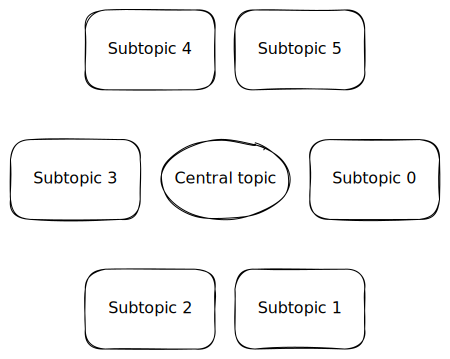

### Rotation
You can rotate any element. Angles are in radians.

```python
scene.rectangle('Rotated by 45°').center(0, 0).rotate(math.radians(45))
```

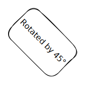

### Shape Size
You can define the dimensions of a shape using the `size()` method. It accepts width and height.

```python
scene.rectangle('Small').size(80, 64).center(0, 0)    
scene.rectangle('Medium').size(100, 80).center(100, 0)
scene.rectangle('Large').size(150, 120).center(235, 0)
```
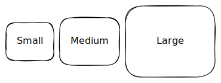


### Styling
A diagram communicates through more than just shapes. The *style* tells a story.

#### Stroke Style
Control the line style with `.stroke()`. Options: `'solid'`, `'dashed'`, `'dotted'`.
```python
scene.ellipse().center(-150, 0).stroke('solid')
scene.ellipse().center(0, 0).stroke('dashed')
scene.ellipse().center(150, 0).stroke('dotted')
```


#### Stroke Thickness
Adjust the line width with `.thickness()`. Options: `'thin'` (1), `'bold'` (2), `'extra-bold'` (3).
```python
scene.rectangle().thickness('thin')
scene.rectangle().thickness('bold')
scene.rectangle().thickness('extra-bold')
```


#### Fill Style
Choose how shapes are filled with `.fill()`. Options: `'solid'`, `'hachure'` (sketchy lines), `'cross-hatch'`.
```python
scene.ellipse().center(-150, 0).background('gray').fill('solid')
scene.ellipse().center(0, 0).background('gray').fill('hachure')
scene.ellipse().center(150, 0).background('gray').fill('cross-hatch')
```
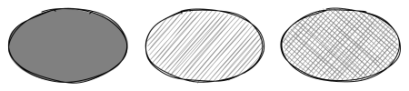

#### Roundness
Shapes can have sharp or rounded corners. Use the `roundness()` method to toggle between them. Note that this method is not applicable to the `Ellipse` element.
```python
scene.rectangle('Rounded').roundness('round').center(0, 0)
scene.rectangle('Sharp').roundness('sharp').center(150, 0)
scene.diamond('Rounded').roundness('round').center(0, 100)
scene.diamond('Sharp').roundness('sharp').center(150, 100)
```


#### Sloppiness
Control the hand-drawn effect with `.sloppiness()`. Options: `'architect'` (clean), `'artist'` (balanced), `'cartoonist'` (messy).
```python
scene.rectangle().sloppiness('architect')
scene.rectangle().sloppiness('artist')
scene.rectangle().sloppiness('cartoonist')
```


#### Opacity
Control opacity/transparency with `.opacity(0-100)`.
```python
scene.ellipse().center(70, 0).background('gray').fill('cross-hatch')
scene.ellipse().center(0, 0).background('DarkGray').fill('solid').opacity(80)
```


### Colors
So far we have only used the black/gray colors. But we can use any color we want.
Excaligen supports multiple color formats:
- **Named Colors**: `"MidnightBlue"`, `"Tomato"`, `"MintCream"`.
- **RGB as a string (Hex Colors)**: `"#FF5733"`.
- **RGB**: `scene.color().rgb(100, 149, 237)`.
- **HSL**: `scene.color().hsl(200, 80, 60)`.

```python
# Add a rectangle with a named color
(
    scene.rectangle('Action')
    .position(0, 0)
    .color("BlueViolet")
    .background("Lavender")
)

# Add an ellipse with RGB color as a string
(
    scene.ellipse('Start')
    .position(150, 0)
    .color('#FF5733')
    .background('#FFBD33')
)

# Add a diamond with HSL color
(
    scene.diamond('Decision')
    .position(300, 0)
    .color(scene.color().hsl(120, 100, 25))
    .background(scene.color().hsl(120, 100, 85))
)
```


#### Advanced Color Manipulation
Look again at the previous example. A shape's `color()` method accepts either a string or a `Color` object.

Passing a string as e.g. 'Lavender' or '#FF5733' is the easiest way to set a color.

However, if you need more control, you can pass a Color object, that you can create using the `scene.color()` helper. This is useful for **generating colors programatically**. The color object exposes the `rgb()` and `hsl()` methods to create colors.

```python
color_1 = scene.color().rgb(250, 120, 10)
color_2 = scene.color().hsl(200, 80, 60)

scene.rectangle('Color 1').color(color_1).background(color_1).center(0, 0)
scene.rectangle('Color 2').color(color_2).background(color_2).center(150, 0)
```

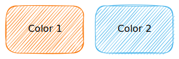

There are also methods `lighten()` and `darken()` to manipulate lightness of the colors, taking a percentage as an argument.

```python
for i in range(5, 30, 5):
    color = scene.color().rgb(250, 120, 10).darken(i)
    (
        scene.ellipse()
        .center(i * 20, 0)
        .size(80, 80)
        .color(color)
        .background(color)
        .fill('solid')
    )
```


Using the HSL color space you can also manipulate the saturation and hue of the colors.

```python
for i in range(0, 90, 10):
    color = scene.color().hsl(200, 80 - i, 60)
    (
        scene.ellipse()
        .center(i * 10, 0)
        .size(80, 80)
        .color(color)
        .background(color)
        .fill('solid')
    )

    color = scene.color().hsl(200 + i, 80, 60)
    (
        scene.ellipse()
        .center(i * 10, 100)
        .size(80, 80)
        .color(color)
        .background(color)
        .fill('solid')
    )
```


### Hyperlinks
You can make any element clickable by adding a link.

```python
scene.rectangle("Click Me").link("https://google.com")
```

---
## Connectors (Arrows)

Diagrams are about relationships. `Arrow` is a powerful element to express them.

### Binding
The most robust way to connect elements is **binding** them by an arrow. When elements move, bound arrows follow.

```Python
source = scene.rectangle('Source').center(0, 0)
target = scene.rectangle('Target').center(120, 0)
scene.arrow().bind(source, target)
```
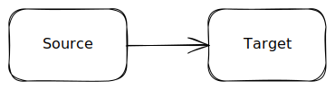

### Labels
Arrows can have labels.

```Python
source = scene.rectangle('Source').center(0, 0)
target = scene.rectangle('Target').center(320, 0)
scene.arrow('My Label').bind(source, target)
```

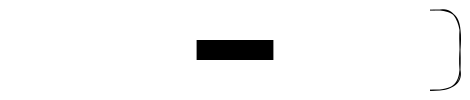

### Styling
You can adjust color, stroke style, thickness, and sloppiness in the same way as for shapes.

```python
source = scene.rectangle('Source').center(0, 0)
target = scene.rectangle('Target').center(220, 0)
scene.arrow().bind(source, target).color('red').stroke('dashed').thickness('extra-bold')
```


### Arrowheads
Customize the start and end markers.
Options are:
- `'arrow'`
- `'bar'`
- `'dot'`
- `'triangle'`
- `None`

```python
y = 0
for arrow_head in [None, 'arrow', 'bar', 'dot', 'triangle']:
    start_element = scene.ellipse().center(0, y).size(30, 30).color('gray')
    end_element = scene.rectangle(f"{arrow_head}").center(120, y).size(100, 30).color('gray')
    scene.arrow().bind(start_element, end_element).arrowheads(None, arrow_head).color('blue')
    y += 50
```

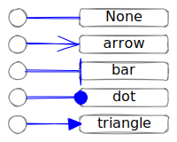

You can of course use any combination of arrowheads, e.g. starting with a dot and ending with a triangle.

### Path Styles
It's about how the arrow gets from A to B.
Excalidraw supports direct, elbowed and freeform paths. Excaligen adds convenience methods to control the curved and arc paths. 
In summary, you can control the arrow path to achieve:
- Straight connection
- Elbow (orthogonal) connection
- Curved connection
- Arc connection
- Freeform connection

#### Straight Connection(Default)
A direct line between shapes, you saw it in the previous examples.

```python
scene.arrow().bind(node_a, node_b)
```

#### Elbow (Orthogonal) Connection
Elbow arrows provide a structured way to connect elements using only horizontal and vertical segments. This is ideal for complex diagrams like flowcharts or system architectures, as it helps avoid diagonal lines that can make a layout look cluttered or confusing.

You specify the exit direction from `start` and entry direction to `end` (`'U'`, `'D'`, `'L'`, `'R'`) meaning up, down, left, right.

```python
begin = scene.rectangle('Begin').center(0, 0).size(160, 70)
end = scene.ellipse('End').center(400, -200).size(130, 50)
scene.arrow().elbow('R', 'L').bind(begin, end)
scene.arrow().elbow('U', 'U').bind(begin, end)
scene.arrow().elbow('D', 'D').bind(begin, end)
scene.arrow().elbow('L', 'R').bind(begin, end)
```

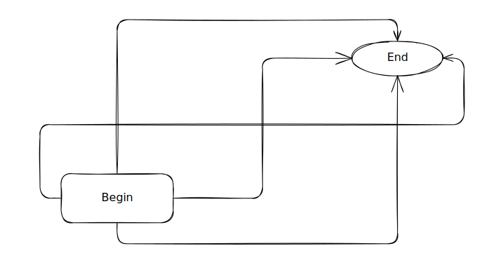

#### Curve Connection
If you prefer more organic, flowing lines, use curve arrows. You define the "tangent" angle at the start and end.
Angles can be radians or convenience directions (`'U'`, `'D'`, `'L'`, `'R'`).

```python
center = scene.ellipse('Center').center(0, 0)
top_left = scene.rectangle('Top Left').center(-300, -100)
top_right = scene.rectangle('Top Right').center(300, -100)
bottom_left = scene.rectangle('Bottom Left').center(-300, 100)
bottom_right = scene.rectangle('Bottom Right').center(300, 100)

scene.arrow().curve('L', 'R').bind(center, top_left)
scene.arrow().curve('L', 'R').bind(center, bottom_left)
scene.arrow().curve('R', 'L').bind(center, top_right)
scene.arrow().curve('R', 'L').bind(center, bottom_right)
```


As mentioned above, you can use angles instead of directions. Just please be aware that the underlying approximation algorithm tries to use as few control points as possible, so the resulting curve might not be exactly what you expect.

```python
center = scene.ellipse('Main').center(-250, 0)
bottom_left = scene.rectangle('Bottom Left').center(-160, 200)
bottom_right = scene.rectangle('Bottom Right').center(160, 200)
bottom_center = scene.rectangle('Bottom Center').center(0, 200)

scene.arrow().curve(math.radians(15), 'U').bind(center, bottom_right)
scene.arrow().curve(math.radians(30), 'U').bind(center, bottom_center)
scene.arrow().curve(math.radians(45), 'U').bind(center, bottom_left)
```

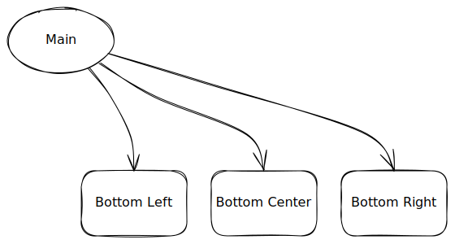

#### Arc Connection
Arc arrows create a circular path between two points, maintaining a constant radius. This is ideal for circular layouts, cycles, or when you need a consistent, rounded connection that follows a specific curvature.

```python
RADIUS = 300
elements = []

for angle in range(0, 360, 30):
    rect = scene.ellipse(f'{angle}°').orbit(0, 0, RADIUS, math.radians(angle)).size(80, 60)
    elements.append(rect)

start_element = elements[0]
for i in range(1, len(elements)):
    scene.arrow().arc(RADIUS).bind(start_element, elements[i])
    start_element = elements[i]
```


#### Freeform Connection
Freeform arrows provide a flexible way to connect elements using a series of points. This is ideal for complex diagrams where you need to create a custom path between two points.
The line segments can connect to each other in a sharp or rounded way.

```python
START = 50
END = 500

start = scene.ellipse('start').center(0, 0).size(100, 100)
end = scene.ellipse('end').center(530, 0).size(60, 60)
points = [(START, 0), (300, -30), (250, 30), (END, 0)]
scene.arrow().points(points).bind(start, end).roundness('sharp')
```

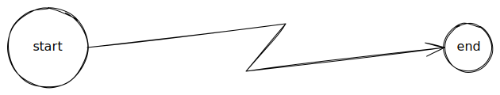

You can e.g. generate the points by using harmonic functions:

```python
START = 50
END = 500
NUM_POINTS = 30
NUM_CYCLES = 5
points = [(
    x := START + (t := i / (NUM_POINTS - 1)) * (END - START), 
    (envelope := 50 * math.sin(math.pi * t)) * math.sin(2 * math.pi * NUM_CYCLES * t)) 
    for i in range(NUM_POINTS)]

start = scene.ellipse('start').center(0, 0).size(100, 100)
end = scene.ellipse('end').center(530, 0).size(60, 60)

scene.arrow().points(points).bind(start, end)
```

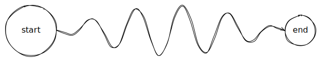

---

## Typography (Text)
You have already seen some text labels in the previous examples. Those labels used the default font and default styling.
E.g. the code `rectangle('Hello')` creates a rectangle with the text 'Hello' in it, rendered in the default font and styling.

If you want to create a text label using non-default font and styling, you need to create a text element using the `text()` instead of using a plain text string.

### Fonts
The following fonts are available in Excalidraw:
- Excalifont
- Comic Shaans
- Lilita One
- Nunito
- Hand-drawn
- Normal
- Code

```python
for i, font in enumerate(['Excalifont', 'Comic Shaans', 'Lilita One', 'Nunito', 'Hand-drawn', 'Normal', 'Code']):
    scene.text(f"{font}").center(0, i * 20).font(font)
```


### Font Size
You can set the font size using the `.fontsize()` method. The available sizes are 'S', 'M', 'L', and 'XL'.
You can also get the size of a text element using the `size()` method without any arguments.

```python
y = 0
for size in ['S', 'M', 'L', 'XL']:
    text = scene.text(f"Excalifont ({size})").font('Excalifont').center(0, y).fontsize(size)
    w, h = text.size()
    y += h
```

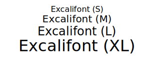

### Color
Let's create a non-default text label for an element apply some color to it.

```python
colored_text = (scene.text("Hello, World!")
    .font('Lilita One')
    .fontsize('L')
    .color('Violet')
)
scene.rectangle(colored_text).size(200, 100).center(0, 0)
```

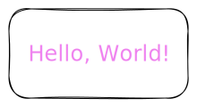

### Layout Helpers

#### Justification
```python
y = 0
for baseline in ['top', 'middle', 'bottom']:
    x = -300
    for align in ['left', 'center', 'right']:
        scene.rectangle(scene.text(f'{align}-{baseline}').align(align).baseline(baseline)).size(200, 120).center(x, y)
        x += 300
    y += 150
```


#### Anchoring
```python
def cross(center: tuple[float, float], color: str) -> None:
    x, y = center
    scene.line().points([[x - 20, y], [x + 20, y]]).color(color)
    scene.line().points([[x, y - 20], [x, y + 20]]).color(color)

scene = SceneBuilder()
x = 42.0
y = 0.0

for h_align in ["left", "center", "right"]:
    for v_align in ["top", "middle", "bottom"]:
        cross((x, y), 'red')
        scene.text().anchor(x, y, h_align, v_align).content(f"{h_align}-{v_align}").fontsize("M").font("Hand-drawn").color("black")
        y += 60.0
```


Text needs to be placed precisely.
- **`justify(x, y, w, h)`**: Aligns text within a box.
- **`anchor(x, y, h_align, v_align)`**: Anchors text to a point (e.g., top-left).
---

## Lines & Custom Shapes
The Line object accepts a list of points. It uses 'round' interpolation between points by default.

```python
scene.line().points([(-100, 0), (0, 30), (50, -50), (100, 0)]).thickness('extra-bold')
```
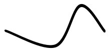


### Custom Polygons
The Line object has a convenience method `.close()` to connect the last point to the first. This creates a shape that can be filled.

```python
points = [[-100, 0], [100, 0], [0, -100]]
(
    scene.line()
    .points(points)
    .close()
    .background('lightgreen')
    .fill('cross-hatch')
    .color('darkgreen')
    .roundness('sharp')
    .thickness('bold')
)
```


Example of a more complex polygon:

```python
OUTER_R = 80
INNER_R = 35
NUM_POINTS = 10

star_points = [(
    (r := (OUTER_R if i % 2 == 0 else INNER_R)) * math.cos(theta := i * (2 * math.pi / NUM_POINTS)),
    r * math.sin(theta)
) for i in range(NUM_POINTS)]

scene.line().points(star_points).close().roundness('sharp')
```


---

## Images
Sometimes you need to include images in your scenes. You can do this using Image objects.
Excaligen supports loading images from files, URLs, or even directly from data.

### Loading Images from Files
The following example shows how to load an image from a file and combine it with text.
```python
scene.image().file("assets/robot.svg").center(0, 0)
scene.text("Oh look, I'm expressing joy").center(0, -150)
scene.text("how utterly revolting").center(0, 130)
```


### Loading Images from Data
You can provide the image data directly. The following example shows how to load an SVG image from a string
```python
    IMAGE_DATA = '''
        <svg xmlns="http://www.w3.org/2000/svg" width="467" height="462" stroke="#000" stroke-width="2">
            <rect x="80" y="60" width="250" height="250" rx="20" fill="#F80"/>
            <circle cx="310" cy="290" r="120" fill="#00F" fill-opacity=".7"/>
        </svg>'''

    scene.image().data(IMAGE_DATA)
```


You can load images from binary data as well, but that is outside the scope of this guide.

### Loading Images from URLs
```python
scene.image().url("https://picsum.photos/512/320")
```

### Fitting Images
You can fit images to a specific size using the `.fit(w, h)` method. This way you don't need to take care of the image size and its aspect ratio, while putting the image in a certain box.
```python
scene.rectangle().size(200, 160).center(0, 0)
scene.image().file('assets/robot.svg').fit(140, 140).center(0, 0)
```


---

## Groups & Frames

Organizing elements is key for complex diagrams. Excaligen supports Excalidraw's **Groups** and **Frames**.

### Groups
A **Group** is a virtual container. Elements in a group are treated as a single unit when moving or selecting them in Excalidraw.

```python
face = scene.ellipse().center(0, 0).size(120, 120).background('Yellow').fill('solid')
eye_l = scene.ellipse().center(-20, -15).size(15, 25).background('Black').fill('solid')
eye_r = scene.ellipse().center(20, -15).size(15, 25).background('Black').fill('solid')
mouth = scene.line().points([(-40, 10), (-15, 35), (15, 35), (40, 10)]).thickness('bold')

scene.group().elements(face, eye_l, eye_r, mouth)
```


### Frames
A **Frame** is a visual container that physically surrounds its content. It has a background color and a title. It's perfect for distinct sections of a diagram or creating presentation slides.

The following example also demonstrates how to generate links.
Excalidraw support external links and links to other elements in the same scene. As the frame is also an element, it can be linked to.

```python
first_frame = scene.frame("Frame 1")
second_frame = scene.frame("Frame 2")

headline_first = (
    scene.text("First Slide")
    .center(0, -150)
)

circle_with_link = (
    scene.ellipse()
    .size(50, 50)
    .background("Green")
    .fill("solid")
    .center(0, -100)
    .link("https://www.google.com")
)

button_next = (
    scene.rectangle("Next")
    .size(100, 50)
    .background("LightBlue")
    .fill("solid")
    .center(0, 0)
    .link(second_frame)
)

headline_second = (
    scene.text("Second Slide")
    .center(0, 300)
)

button_back = (
    scene.rectangle("Back")
    .size(100, 50)
    .background("LightBlue")
    .fill("solid")
    .center(0, 400)
    .link(first_frame)
)

first_frame.elements(headline_first, circle_with_link, button_next)
second_frame.elements(headline_second, button_back)
```
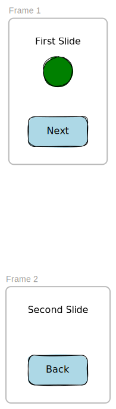

---

## Defaults
What if you want to use specific styles for several elements, but you don't want to type e.g. `stroke('solid')`, `fill('solid')`, etc. for each element? 
Excaligen provides the `Defaults` object for this purpose. Here is an example that we used in the firts chapter, but with our own defaults:

```python
(
    scene.defaults()
    .stroke('solid')
    .thickness('bold')
    .fill('solid')
    .roundness('round')
    .sloppiness('architect')
    .font('Nunito')
)

central_topic = scene.ellipse('Central topic').center(0, 0)
subtopic = scene.rectangle('Subtopic').center(350, 100)
scene.arrow('points to').bind(central_topic, subtopic)  
```


---

## Algorithmic Generation

The true power of Excaligen lies in automation. Below are real-world examples of generating complex diagrams programmatically.
You can find the source code for these examples in the 'examples' directory.

### Mind Map Example
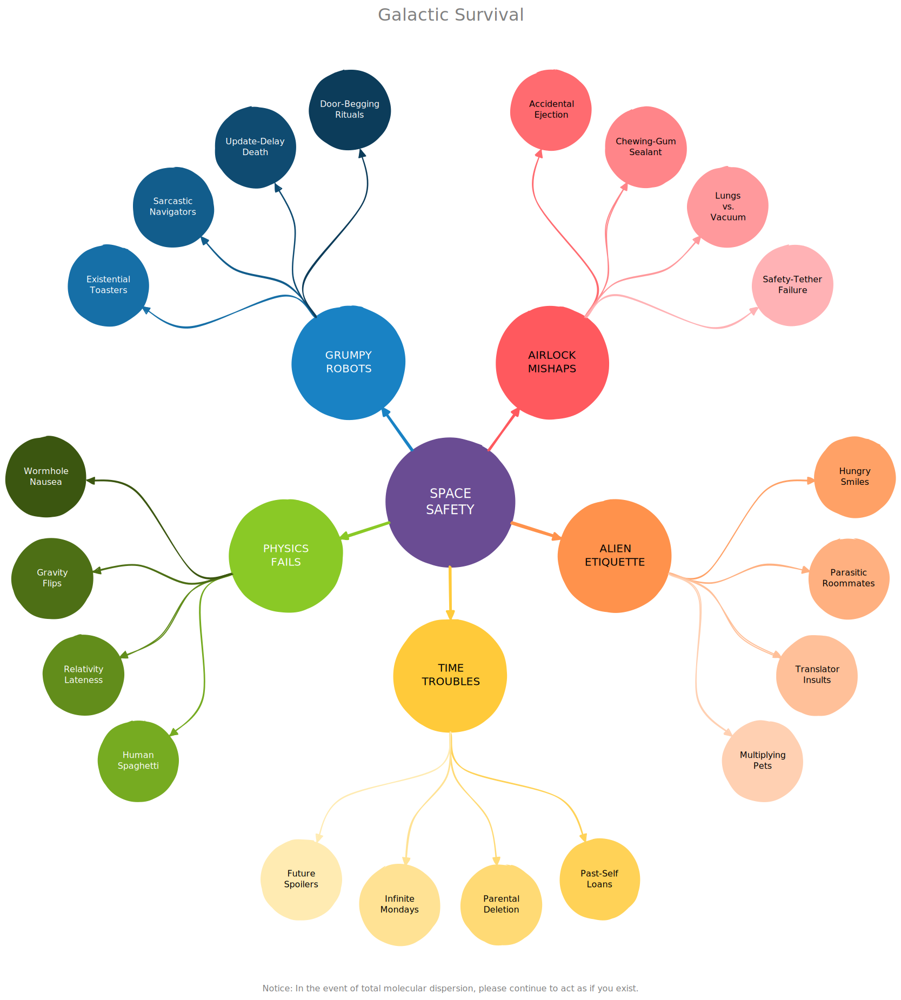

### Workflow Example
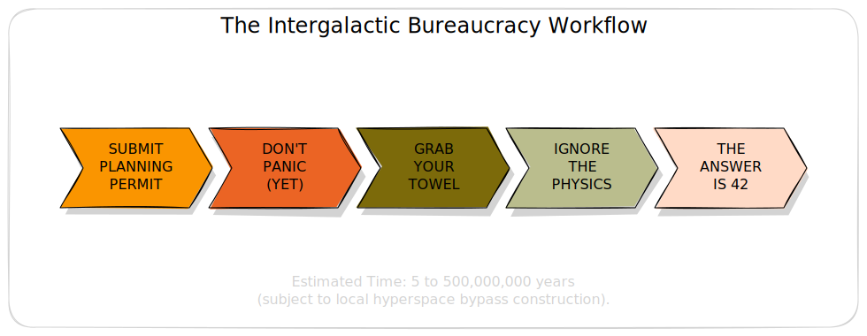

### Pie Chart Example


### Curves and Arrows Example
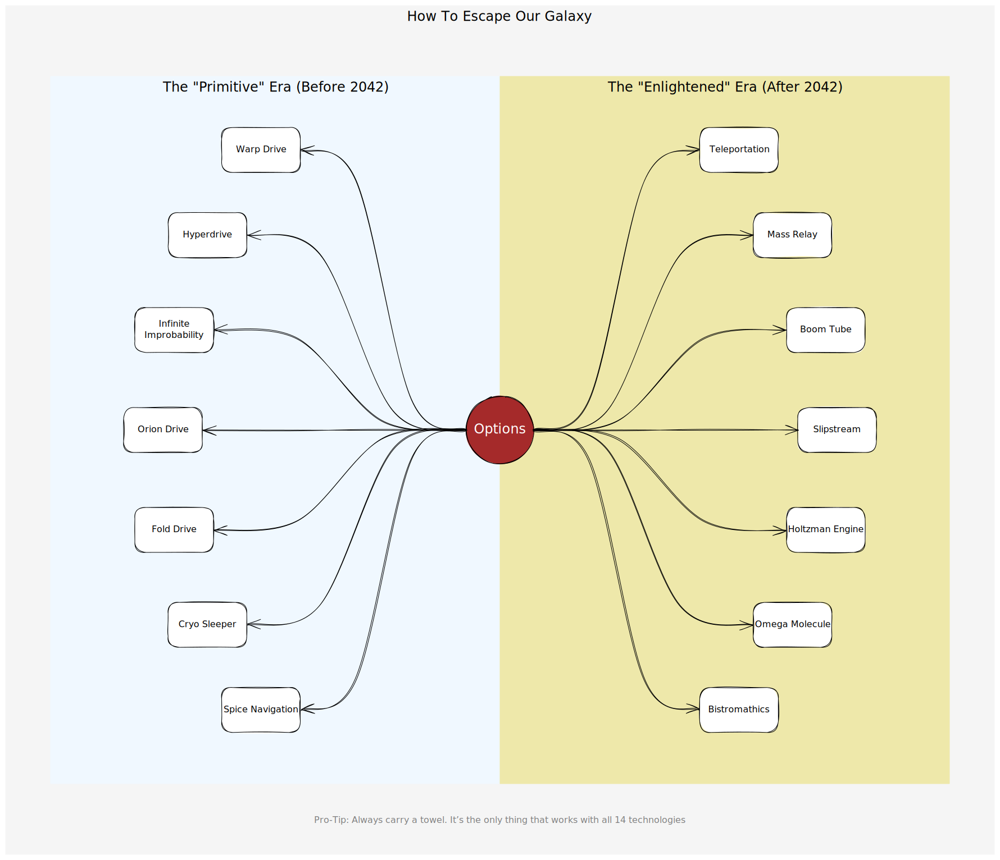

### Beyond Diagrams
You are not limited to creating diagrams. Excalidraw is a tool for creative people and so is Excaligen.
Can you guess what the following code generates?

```Python
D = 42 * (42 * (42 * (42 * (42 * (42 * (42 * (42 * 3) + 25) + 26) + 2) + 28) + 30) + 8)

for y in range(8):
    for x in range(11):
        if (D >> ((y * 6) + abs(5 - x))) & 1:
            s.rectangle().position(x * 42, y * 42).size(42, 42).color('#ff4242').background("#ff4242").fill("solid").roundness('sharp').sloppiness('architect')
```
Congratulations you have reached the end of the guide. After running the last example code you know the "Answer to the Ultimate Question of Life, the Universe, and Everything" 😀

---
Have fun with **Excaligen**.
