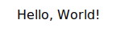
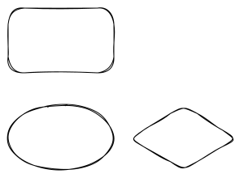
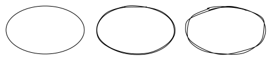
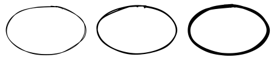
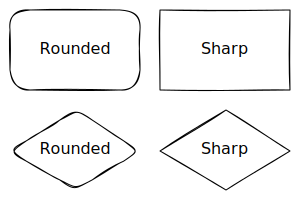

# Excaligen User Manual

**Excaligen** bridges the gap between code and visual expression, bringing programmatic power to the Excalidraw aesthetic.

Generate Excalidraw-compatible files directly from Python. Visualize data structures, automated reports, and complex algorithmic patterns with minimal boilerplate.


## Table of Contents
- [Chapter 1: The First Sketch](#chapter-1-the-first-sketch)
- [Chapter 2: Shapes & Styles](#chapter-2-shapes--styles)
- [Chapter 3: Arrows & Connecting the Elements](#chapter-3-arrows--connecting-the-elements)
- [Chapter 4: Typography & Text](#chapter-4-typography--text)
- [Chapter 5: Lines](#chapter-5-lines)
- [Chapter 6: Images](#chapter-6-images)
- [Chapter 7: Consistency & Defaults](#chapter-7-consistency--defaults)
- [Chapter 8: Algorithmic Generation](#chapter-8-algorithmic-generation)

---

## Chapter 1: The First Sketch

We begin with the essential `SceneBuilder`. This is your canvas.

Create a file named `hello_world.py`:

```python
from excaligen.SceneBuilder import SceneBuilder

scene = SceneBuilder()
scene.text('Hello, World!')
scene.save('hello_world.excalidraw')
```

Executing this script produces a file ready for Excalidraw.



It is that straightforward.

---

## Chapter 2: Shapes & Styles

Excalidraw is beloved for its hand-drawn feel. Excaligen gives you full programmatic control over this unique aesthetic.

### Elements
Excalidraw provides a set of core primitives. We expose them in Excaligen directly.

- **Rectangle**: The workhorse of diagrams. Perfect for nodes, heavy containers, or UI mockups.
- **Ellipse**: Great for states, start/end points, or emphasizing flow.
- **Diamond**: The classic decision node in flowcharts.

We can assign labels to shapes, set their positions and sizes.

```python
scene.rectangle('Rectangle').center(-150, 0)
scene.ellipse('Ellipse').center(0, 0)
scene.diamond('Diamond').center(150, 0)
```

The texts in the above example 'Rectangle', 'Ellipse' and 'Diamond' are the labels of the elements. They have nothing to do with the element type; you can put any text you want in the label.


### Element Center & Position
You have seen how to set the center of an element. The x and y coordinates of the center() method define the center of the element (higher y values are further down the page).

```python
scene.ellipse().center(0, 0)
scene.rectangle().center(0, -120)
scene.diamond().center(150, 0)
```


Sometimes it is more convenient to set the position of the element instead of the center. The position() method defines the upper left corner of the element.

```python
scene.rectangle('Rectangle 1').position(0, 0)
scene.rectangle('Rectangle 2').position(150, 0)
scene.rectangle('Rectangle 3').position(0, 120)
```


### Element Size
You can define the dimensions of an element using the `size()` method. It accepts width and height.

```python
scene.rectangle('Small').size(80, 64).center(0, 0)    
scene.rectangle('Medium').size(100, 80).center(100, 0)
scene.rectangle('Large').size(150, 120).center(235, 0)
```


### The Visual Vocabulary
A diagram communicates through more than just shapes. The *style* of a line tells a story.

#### Stroke Styles
How a line is drawn changes its meaning:
- **Solid**: A strong, definite relationship or boundary. The default.
- **Dashed**: Often implies a tentative connection, a future state, or a secondary boundary.
- **Dotted**: Used for weak links, annotations, or "ghost" elements.

Example:
```python
scene.ellipse().center(-150, 0).stroke('solid')
scene.ellipse().center(0, 0).stroke('dashed')
scene.ellipse().center(150, 0).stroke('dotted')
```


#### Fill Styles
Excalidraw's fill styles are iconic. You can choose how your shapes are filled:
- **Solid**: A full, opaque fill.
- **Hachure**: The classic, sketchy diagonal lines. Distinctively "Excalidraw".
- **Cross-Hatch**: Dense, crossed lines for a heavier, darker selection.

```python
scene.ellipse().center(-150, 0).background('gray').fill('solid')
scene.ellipse().center(0, 0).background('gray').fill('hachure')
scene.ellipse().center(150, 0).background('gray').fill('cross-hatch')
```


#### Sloppiness (Roughness)
This is the magic ingredient. It determines how "hand-drawn" your diagram looks.
- **Architect**: Precise, straight lines. Clean and professional.
- **Artist**: The default. A balanced, natural sketchiness.
- **Cartoonist**: Very messy and playful.

```python
scene.ellipse().center(-150, 0).sloppiness('architect')
scene.ellipse().center(0, 0).sloppiness('artist')
scene.ellipse().center(150, 0).sloppiness('cartoonist')
```


#### Stroke Thickness
You can choose how thick your lines are:
- **Thin**: A light, delicate line.
- **Bold**: A strong, bold line.
- **Extra-bold**: A heavy, powerful line.

```python
scene.ellipse().center(-150, 0).thickness('thin')
scene.ellipse().center(0, 0).thickness('bold')
scene.ellipse().center(150, 0).thickness('extra-bold')
```

The method thickness() also accepts integers 1, 2 or 3.



### Roundness
Elements can have sharp or rounded corners. Use the `roundness()` method to toggle between them. Note that this method is not applicable to the `Ellipse` element.
```python
scene.rectangle('Rounded').roundness('round').center(0, 0)
scene.rectangle('Sharp').roundness('sharp').center(150, 0)
scene.diamond('Rounded').roundness('round').center(0, 100)
scene.diamond('Sharp').roundness('sharp').center(150, 100)
```



### Colors
So far we have only used the black/gray colors. But we can use any color we want.
Excaligen supports multiple color formats:
- **Named Colors**: `"MidnightBlue"`, `"Tomato"`, `"MintCream"`.
- **RGB as a string (Hex Colors)**: `"#FF5733"`.
- **RGB**: `scene.color().rgb(100, 149, 237)`.
- **HSL**: `scene.color().hsl(200, 80, 60)`.


```python
# Add a rectangle with a named color
(
    scene.rectangle('Action')
    .position(0, 0)
    .color("BlueViolet")
    .background("Lavender")
)

# Add an ellipse with RGB color as a string
(
    scene.ellipse('Start')
    .position(150, 0)
    .color('#FF5733')
    .background('#FFBD33')
)

# Add a diamond with HSL color
(
    scene.diamond('Decision')
    .position(300, 0)
    .color(scene.color().hsl(120, 100, 25))
    .background(scene.color().hsl(120, 100, 85))
)
```
## Chapter 3: Arrows & Connecting the Elements

Diagrams are fundamentally about relationships. Arrows are the most common way to express these relationships.

### Intelligent Binding
In Excaligen, you **bind** arrows to elements. If the nodes move, the arrow adapts automatically.

```python
scene.arrow().bind(start_node, end_node)
```

### Labeling
Arrows can communicate what the relationship is. You can pass a label directly to the arrow constructor.

```python
scene.arrow("connects to").bind(a, b)
```

### Arrowheads
Arrows don't just point. They can start or end with different symbols.
Supported styles: `'arrow'`, `'bar'`, `'dot'`, `'triangle'`, or `None`.

```python
scene.arrow().bind(a, b).arrowheads(start='dot', end='arrow')
```

### Path Control
The path an arrow takes is crucial for readability.

#### Elbow (Orthogonal)
Perfect for technical diagrams. You specify the exit and entry directions ('U', 'D', 'L', 'R').

```python
# Leave Right, Enter Left
scene.arrow().bind(a, b).elbow("R", "L") 
```

#### Curve & Arc
For organic flows.
- **Curve**: `curve(start_angle, end_angle)` defaults to 0.
- **Arc**: `arc(radius)` creates a circular path.

```python
scene.arrow().bind(a, b).arc(10)
```

### Explicit Points
For total control, you can define the exact points the arrow follows. When defining points manually, you can also control the `roundness()` (sharp or round).

```python
from excaligen.geometry.Point import Point

# A custom path with sharp corners
(
    scene.arrow()
    .points([Point(0, 0), Point(50, 50), Point(100, 0)])
    .roundness("sharp")
)
```

### Spacing (Gaps)
Sometimes you want some breathing room. Use `gap()` to offset the arrow from the bound elements.

```python
scene.arrow().bind(a, b).gap(20)
```

---

## Chapter 4: Typography & Text
### The Basics
Adding text is as simple as adding a shape.
```python
scene.text('Hello, World!')
```
The 'Text' element also handles multi-line strings.
```python
scene.text("Use text\nfor labels\nand notes.")
```

### Styling Text
You have granular control over how your text appears.

#### Font Family
Choose the right voice for your text:
- **Hand-drawn**: The classic Excalidraw look (Virgil).
- **Code**: Monospaced, perfect for snippets (Cascadia).
- **Normal**: Clean sans-serif (Helvetica/Arial).
- Others: `Comic Shaans`, `Lilita One`, `Nunito`.

```python
scene.text("def hello():\n    print('Hi')").font("Code")
```

#### Size & Alignment
- **Size**: Use semantic sizes (`"S"`, `"M"`, `"L"`, `"XL"`) or exact integers.
- **Alignment**:
  - Horizontal: `.align("left")`, `.align("center")`, `.align("right")`
  - Vertical: `.baseline("top")`, `.baseline("middle")`, `.baseline("bottom")`

```python
scene.text("Title").fontsize("XL").align("center")
```

### Layout Helpers
Positioning text precisely can be tricky. Excaligen provides helpers to place text relative to coordinates or boxes.

- **`anchor(x, y, align, baseline)`**: Anchors the text to a specific point.
- **`center(x, y)`**: Centers the text exactly at the given point.
- **`justify(x, y, w, h)`**: Aligns the text within a bounding box according to its alignment settings.

```python
# Places text centered in a 100x50 box at (0,0)
scene.text("Button").align("center").justify(0, 0, 100, 50)

# Anchors text top-left corner to (10, 10)
scene.text("Chapter 1").anchor(10, 10, "left", "top")
```


---

## Chapter 5: Lines

Sometimes you need more than a simple rectangle or ellipse. The `Line` element allows you to draw arbitrary paths.

### Basic Lines
A line is defined by a sequence of points.

```python
from excaligen.geometry.Point import Point

scene.line().points([
    Point(0, 0),
    Point(100, 50),
    Point(200, 0)
])
```

### Custom Shapes (Closed Lines)
You can `close()` a line to connect its last point back to the first. This effectively creates a custom polygon.

Once closed, the line behaves like a shape: you can give it a **background color** and a **fill style**.

```python
# Create a triangle
(
    scene.line()
    .points([Point(0, 0), Point(50, 100), Point(100, 0)])
    .close()
    .background("MistyRose")
    .fill("cross-hatch")
)
```

### Styling
Just like other elements, lines accept standard styles for stroke, roughness, and roundness.

```python
# A smoothed path
scene.line().points([...]).roundness("round")
```

---

## Chapter 6: Images

Bring external assets—screenshots, logos, or diagrams—into your scene.

### Loading Images
You can load images from various sources:

- **Local File**: `scene.image().file("./assets/logo.png")`
- **URL**: `scene.image().url("https://example.com/chart.png")`
- **Raw Data**: `scene.image().data(svg_string_or_bytes)`

### Sizing
Images often need to fit into a specific layout. Use `.fit()` to scale an image to fit within a bounding box while preserving its aspect ratio.

```python
# Load a logo and constrain it to a 200x200 box
scene.image().file("logo.png").fit(200, 200)
```

---


## Chapter 7: Consistency & Defaults

When creating a large diagram, repeating style method calls (`.font("Code").color("Blue")`) is redundant and error-prone.

Use `scene.defaults()` to establish a baseline for your entire scene. This sets the "theme" of your diagram.

```python
# Set global style: "Artist" sloppiness, specific font, and color.
scene.defaults().sloppiness("artist").font("Nunito").color("DarkSlateGray")

# All subsequent elements inherit these traits
scene.text("I inherit the default style")
scene.rectangle().label("Me too")
```

This ensures visual consistency and keeps your code clean.

---

## Chapter 8: Algorithmic Generation

The true power of Excaligen lies in automation. You can visualize recursive structures or generate diagrams from data that would be tedious to draw by hand.

### Recursive Mind Map
Consider a mind map generated from a dictionary. With a simple recursive function, you can layout a tree structure where branches position themselves automatically.

See `examples/mind_map.py` for an implementation that turns a Python dictionary into a visual tree, handling node creation and connections recursively.

---

**Excaligen**. valid. plain. visual.
