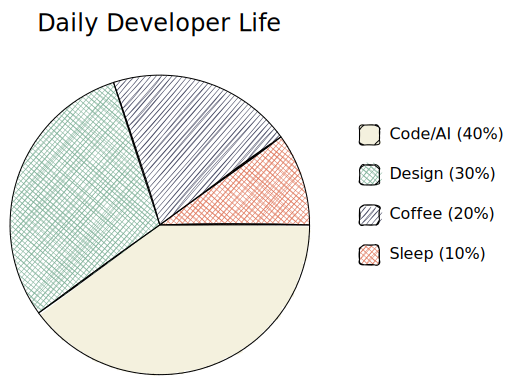
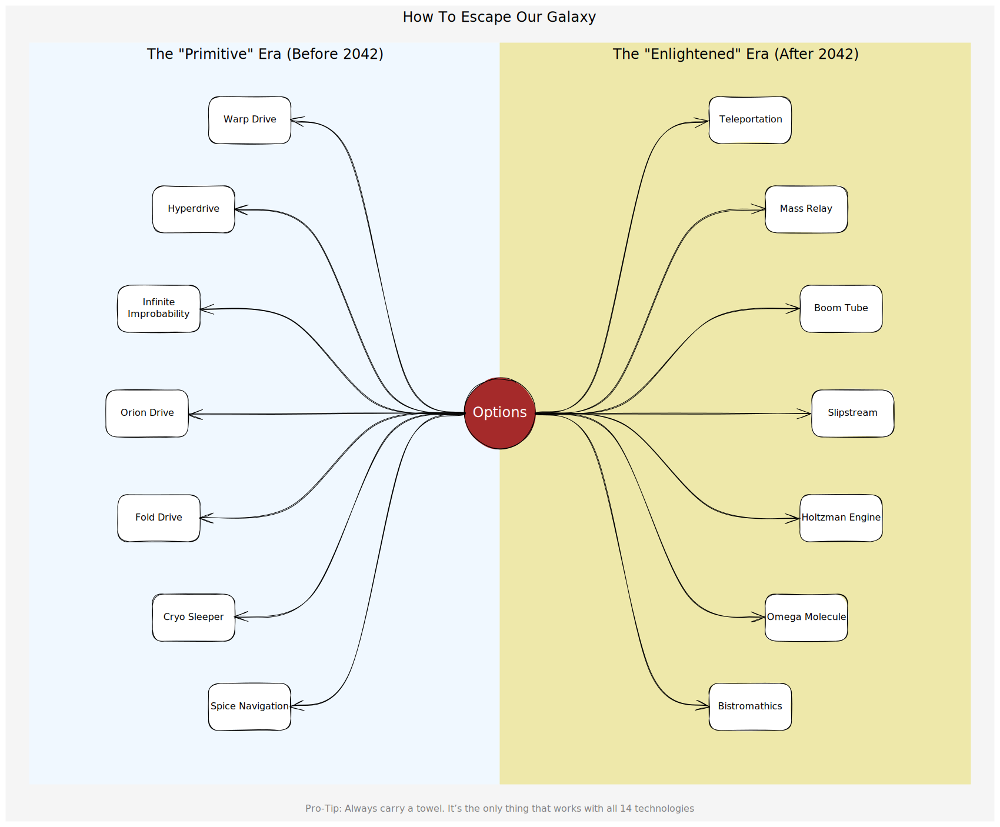

# Excaligen User Manual

**Excaligen** bridges the gap between the fantastic diagram editor [Excalidraw](https://excalidraw.com/) and algorithmic visualization.
Excalidraw is well known for its beautiful, hand-drawn aesthetic. 

If you want to generate Excalidraw-compatible files directly from Python, Excaligen is the tool for you. Visualize data structures, automated reports, and complex algorithmic patterns with minimal boilerplate.

## Table of Contents
- [Chapter 1: Concepts & The First Sketch](#chapter-1-concepts--the-first-sketch)
- [Chapter 2: Shapes & Styles](#chapter-2-shapes--styles)
- [Chapter 3: Connectors (Arrows)](#chapter-3-connectors-arrows)
- [Chapter 4: Typography (Text)](#chapter-4-typography-text)
- [Chapter 5: Lines & Custom Shapes](#chapter-5-lines--custom-shapes)
- [Chapter 6: Images](#chapter-6-images)
- [Chapter 7: Groups & Frames](#chapter-7-groups--frames)
- [Chapter 8: Consistency & Defaults](#chapter-8-consistency--defaults)
- [Chapter 9: Algorithmic Generation](#chapter-9-algorithmic-generation)

---
## Chapter 1: Concepts & The First Sketch

### The SceneBuilder
The heart of Excaligen is the `SceneBuilder` class. Think of it as your canvas and your toolbox combined.

**Important**: You should always create elements using the `SceneBuilder` methods (like `.rectangle()`, `.arrow()`, etc.). **Do not instantiate element classes directly.** The builder ensures everything is correctly initialized and tied to the diagram.

### Hello World

Create a file named `hello_world.py`:

```python
from excaligen.SceneBuilder import SceneBuilder

scene = SceneBuilder()
scene.text('Hello, World!')
scene.save('hello_world.excalidraw')
```

Executing this script produces a file ready for Excalidraw.


### The Fluent API
Excaligen uses a "fluent" API style. This means you can chain method calls together to configure your elements concisely.

```python
from excaligen.SceneBuilder import SceneBuilder

scene = SceneBuilder()
central_topic = scene.ellipse('Central topic').center(0, 0)
subtopic = scene.rectangle('Subtopic').center(350, 100)
scene.arrow('points to').bind(central_topic, subtopic)

scene.save('binding.excalidraw')
```


The next chapters will explain the API in detail. **We will omit the imports and `scene.save()` calls in examples for brevity.**

---
## Chapter 2: Shapes & Styles

Excalidraw is beloved for its hand-drawn feel. Excaligen gives you full programmatic control over this unique aesthetic.

### Core Shapes
Excaligen exposes the core Excalidraw shapes:
- **Rectangle**: `scene.rectangle()`
- **Ellipse**: `scene.ellipse()`
- **Diamond**: `scene.diamond()`

```python
scene.rectangle('Rectangle').center(-150, 0)
scene.ellipse('Ellipse').center(0, 0)
scene.diamond('Diamond').center(150, 0)
```


### Positioning
You have flexible control over where elements go.

#### Center
`center(x, y)` places the geometric center of the element at (x, y).


#### Position
`position(x, y)` places the top-left corner of the element's bounding box at (x, y).


#### Orbit / Polar Coordinates
Ideally suited for mind maps or circular layouts, `orbit()` places an element relative to another one using an angle and radius.

```python
scene.rectangle('Rectangle 1').position(0, 0)
scene.rectangle('Rectangle 2').position(150, 0)
scene.rectangle('Rectangle 3').position(0, 120)
```


What if we want to place several elements around a central point? The orbit() method allows you to do that.
```Python
RADIUS = 150
SUBTOPICS = 6

scene = SceneBuilder()
central_topic = scene.ellipse('Central topic').center(0, 0)
for i in range(SUBTOPICS):
    angle = i * 2 * math.pi / SUBTOPICS
    scene.rectangle(f'Subtopic {i}').orbit(central_topic, RADIUS, angle)

scene.save('sandbox.excalidraw')
```


### Rotation
You can rotate any element. Angles are in radians.

```python
scene.rectangle('Small').size(80, 64).center(0, 0)    
scene.rectangle('Medium').size(100, 80).center(100, 0)
scene.rectangle('Large').size(150, 120).center(235, 0)
```


### Styling
A diagram communicates through more than just shapes. The *style* tells a story.

#### Stroke Style
Control the line style with `.stroke()`. Options: `'solid'`, `'dashed'`, `'dotted'`.
```python
scene.ellipse().center(-150, 0).stroke('solid')
scene.ellipse().center(0, 0).stroke('dashed')
scene.ellipse().center(150, 0).stroke('dotted')
```


#### Stroke Thickness
Adjust the line width with `.thickness()`. Options: `'thin'` (1), `'bold'` (2), `'extra-bold'` (3).
```python
scene.rectangle().thickness('thin')
scene.rectangle().thickness('bold')
scene.rectangle().thickness('extra-bold')
```


#### Fill Style
Choose how shapes are filled with `.fill()`. Options: `'solid'`, `'hachure'` (sketchy lines), `'cross-hatch'`.
```python
scene.ellipse().center(-150, 0).background('gray').fill('solid')
scene.ellipse().center(0, 0).background('gray').fill('hachure')
scene.ellipse().center(150, 0).background('gray').fill('cross-hatch')
```


#### Roundness
Toggle corner rounding with `.roundness()`. Options: `'sharp'`, `'round'`.
```python
scene.rectangle().roundness('sharp')
scene.rectangle().roundness('round')
```


#### Sloppiness
Control the hand-drawn effect with `.sloppiness()`. Options: `'architect'` (clean), `'artist'` (balanced), `'cartoonist'` (messy).
```python
scene.rectangle().sloppiness('architect')
scene.rectangle().sloppiness('artist')
scene.rectangle().sloppiness('cartoonist')
```


#### Opacity
Control transparency with `.opacity(0-100)`.
```python
scene.rectangle("Ghost").opacity(50)
```

### Colors
Excaligen supports rich color handling.

#### Setting Colors
- **Named Colors**: `"MidnightBlue"`, `"Tomato"`.
- **Hex**: `"#FF5733"`.
- **RGB/HSL**: via the helper methods.

```python
scene.rectangle().color("Blue") # Stroke color
scene.rectangle().background("LightBlue") # Fill color
```


#### Advanced Color Manipulation
You can manipulate colors programmatically using the `scene.color()` helper. This is great for generating palettes or gradients.

```python
# Add a rectangle with a named color
(
    scene.rectangle('Action')
    .position(0, 0)
    .color("BlueViolet")
    .background("Lavender")
)

# Add an ellipse with RGB color as a string
(
    scene.ellipse('Start')
    .position(150, 0)
    .color('#FF5733')
    .background('#FFBD33')
)

# Add a diamond with HSL color
(
    scene.diamond('Decision')
    .position(300, 0)
    .color(scene.color().hsl(120, 100, 25))
    .background(scene.color().hsl(120, 100, 85))
)
```

### Hyperlinks
You can make any element clickable by adding a link.

```python
scene.rectangle("Click Me").link("https://google.com")
```

---
## Chapter 3: Connectors (Arrows)

Diagrams are about relationships. `Arrow` is a powerful element in Excaligen designed to handle complex connections.

### Binding
The most robust way to connect elements is **binding**. When elements move, bound arrows follow.

```python
scene.arrow().bind(start_element, end_element)
```

### Arrowheads
Customize the start and end markers.
Options: `'arrow'`, `'bar'`, `'dot'`, `'triangle'`, `None`.

```python
# A bi-directional arrow with a dot at the start
scene.arrow().bind(a, b).arrowheads(start='dot', end='arrow')
```

### Path Styles
Control *how* the arrow gets from A to B.

#### 1. Straight (Default)
A direct line between centers.

#### 2. Elbow (Orthogonal)
Perfect for flowcharts. You specify the exit direction from `start` and entry direction to `end` (`'U'`, `'D'`, `'L'`, `'R'`).

```python
# Exit Right, Enter Left
scene.arrow().elbow('R', 'L').bind(node_a, node_b)
```

#### 3. Curve (Bezier)
Organic, flowing lines. You define the "tangent" angle at the start and end.
Angles can be radians or convenience directions (`'U'`, `'D'`, `'L'`, `'R'`).

```python
# Curve leaving Up and arriving Down
scene.arrow().curve('U', 'D').bind(node_a, node_b)
```

#### 4. Arc
A circular arc between points.

```python
scene.arrow().arc(100).bind(node_a, node_b)
```

### Spacing (Gap)
Add breathing room between the arrow tip and the element.

```python
scene.arrow().bind(a, b).gap(20) # 20px gap on both ends
```

---

## Chapter 4: Typography (Text)

Adding text is simple.

```python
scene.text('Hello\nWorld')
```

### Styling
- **Font Family**: `.font("Hand-drawn")`, `.font("Code")`, `.font("Normal")`.
- **Size**: `.fontsize("S")`, `"M"`, `"L"`, `"XL"`.
- **Alignment**: `.align("left/center/right")`.

### Layout Helpers
Text needs to be placed precisely.
- **`justify(x, y, w, h)`**: Aligns text within a box.
- **`anchor(x, y, h_align, v_align)`**: Anchors text to a point (e.g., top-left).

---

## Chapter 5: Lines & Custom Shapes

For arbitrary paths or polygons, use `scene.line()`.

### Building a Line
A line is a sequence of points.

```python
from excaligen.geometry.Point import Point

scene.line().points([Point(0,0), Point(100,0), Point(100,100)])
```

### Modifying Points
You can extend lines dynamically:
- **`append([points])`**: Add points to the end.
- **`prepend([points])`**: Add points to the start.

### Custom Polygons
Call `.close()` to connect the last point to the first. This creates a shape that can be filled.

```python
# A custom triangle
scene.line().points([...]).close().background("Red").fill("solid")
```

---

## Chapter 6: Images

Embed external assets like icons or screenshots.

```python
# From file
scene.image().file("./assets/logo.png").fit(200, 200)

# From URL
scene.image().url("https://example.com/chart.png")
```

The `.fit(w, h)` method ensures the image fits within dimensions while maintaining aspect ratio.

---

## Chapter 7: Groups & Frames

Organizing elements is key for complex diagrams. 

### Groups
A **Group** is a virtual container. Elements in a group are selected together in Excalidraw options.

```python
scene.group().elements(rect1, rect2)
```

### Frames
A **Frame** is a visual container with a label and background. It physically surrounds its content.

```python
scene.frame("Section A").elements(rect1, rect2)
```

---

## Chapter 8: Consistency & Defaults

Repeatable styles? Use `defaults()`.

```python
# Set the theme for the scene
scene.defaults().font("Code").color("DarkSlateGray")

# All new elements inherit this
scene.text("I am code font now")
```

---

## Chapter 9: Algorithmic Generation

The true power of Excaligen lies in automation. Below are real-world examples of generating complex diagrams programmatically.

### Mind Map Example


### Workflow Example


### Pie Chart Example


### Curves and Arrows Example


---

---

## Chapter 9: Groups & Frames

Organizing elements is key for complex diagrams. Excaligen provides two ways to group elements: **Groups** and **Frames**.

### Groups
A **Group** is a virtual container. Elements in a group are treated as a single unit when moving or selecting them in Excalidraw, but visually they remain separate.

```python
# Create elements
rect1 = scene.rectangle("A").position(0, 0)
rect2 = scene.rectangle("B").position(100, 0)

# Group them together
scene.group().elements(rect1, rect2)
```

### Frames
A **Frame** is a visual container that physically surrounds its content. It has a background color and a label. It's perfect for distinct sections of a diagram.

Frames automatically adjust their size to fit their content.

```python
# Create elements
step1 = scene.rectangle("Step 1").position(0, 0)
step2 = scene.rectangle("Step 2").position(200, 0)

# Wrap them in a frame
scene.frame("Process Flow").elements(step1, step2)
```

You can also set the title of the frame explicitly:
```python
scene.frame().title("My Frame").elements(...)
```


---

**Excaligen**. valid. plain. visual.
