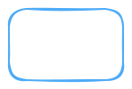
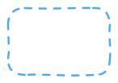
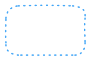
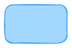
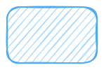

# Excaligen User Manual

**Excaligen** bridges the gap between code and visual expression, bringing programmatic power to the Excalidraw aesthetic.

Generate Excalidraw-compatible files directly from Python. Visualize data structures, automated reports, and complex algorithmic patterns with minimal boilerplate.

---

## Chapter 1: The First Sketch

We begin with the essential `SceneBuilder`. This is your canvas.

Create a file named `hello_world.py`:

```python
from excaligen.SceneBuilder import SceneBuilder

scene = SceneBuilder()
scene.text("Hello, World!")
scene.save("hello_world.excalidraw")
```

Executing this script produces a file ready for Excalidraw. It is that straightforward.

---

## Chapter 2: Shapes & Styles

Excalidraw is beloved for its hand-drawn feel. Excaligen gives you full programmatic control over this unique aesthetic.

### Elemental Shapes
Excalidraw provides a set of core primitives. We expose them directly:

- **Rectangle**: The workhorse of diagrams. Perfect for nodes, heavy containers, or UI mockups.
- **Ellipse**: Great for states, start/end points, or emphasizing flow.
- **Diamond**: The classic decision node in flowcharts.

```python
scene.rectangle().label("Process")
scene.ellipse().label("Start")
scene.diamond().label("Decision")
```

### The Visual Vocabulary
A diagram communicates through more than just shapes. The *style* of a line tells a story.

#### Stroke Styles
How a line is drawn changes its meaning:
- **Solid**: A strong, definite relationship or boundary. The default.

    

- **Dashed**: Often implies a tentative connection, a future state, or a secondary boundary.

    

- **Dotted**: Used for weak links, annotations, or "ghost" elements.

    

Example:
```python
scene.rectangle().stroke("dotted")
```

#### Fill Styles
Excalidraw's fill styles are iconic. You can choose how your shapes are filled:
- **Solid**: A full, opaque fill.

    

- **Hachure**: The classic, sketchy diagonal lines. Distinctively "Excalidraw".

    

- **Cross-Hatch**: Dense, crossed lines for a heavier, darker selection.

    

```python
scene.ellipse().fill("crosshatch")
```

#### Sloppiness (Roughness)
This is the magic ingredient. It determines how "hand-drawn" your diagram looks.
- **Architect**: Precise, straight lines. Clean and professional.
- **Artist**: The default. A balanced, natural sketchiness.
- **Cartoonist**: Very messy and playful.

```python
scene.defaults().sloppiness("architect") # Clean lines for a tech spec
```

### Colors
Express with precision using:
- **Named Colors**: `"MidnightBlue"`, `"Tomato"`, `"MintCream"`.
- **RGB**: `scene.color().rgb(100, 149, 237)`.
- **HSL**: `scene.color().hsl(200, 80, 60)`.

---

## Chapter 3: Typography & Text

A picture is worth a thousand words, but sometimes you just need the words.

### The Basics
Adding text is as simple as adding a shape. The `Text` element handles multi-line strings automatically.

```python
scene.text("Use text\nfor labels\nand notes.")
```

### Styling Text
You have granular control over how your text appears.

#### Font Family
Choose the right voice for your text:
- **Hand-drawn**: The classic Excalidraw look (Virgil).
- **Code**: Monospaced, perfect for snippets (Cascadia).
- **Normal**: Clean sans-serif (Helvetica/Arial).
- Others: `Comic Shaans`, `Lilita One`, `Nunito`.

```python
scene.text("def hello():\n    print('Hi')").font("Code")
```

#### Size & Alignment
- **Size**: Use semantic sizes (`"S"`, `"M"`, `"L"`, `"XL"`) or exact integers.
- **Alignment**:
  - Horizontal: `.align("left")`, `.align("center")`, `.align("right")`
  - Vertical: `.baseline("top")`, `.baseline("middle")`, `.baseline("bottom")`

```python
scene.text("Title").fontsize("XL").align("center")
```

### Layout Helpers
Positioning text precisely can be tricky. Excaligen provides helpers to place text relative to coordinates or boxes.

- **`anchor(x, y, align, baseline)`**: Anchors the text to a specific point.
- **`center(x, y)`**: Centers the text exactly at the given point.
- **`justify(x, y, w, h)`**: Aligns the text within a bounding box according to its alignment settings.

```python
# Places text centered in a 100x50 box at (0,0)
scene.text("Button").align("center").justify(0, 0, 100, 50)

# Anchors text top-left corner to (10, 10)
scene.text("Chapter 1").anchor(10, 10, "left", "top")
```

---

## Chapter 4: Images

Bring external assets—screenshots, logos, or diagrams—into your scene.

### Loading Images
You can load images from various sources:

- **Local File**: `scene.image().file("./assets/logo.png")`
- **URL**: `scene.image().url("https://example.com/chart.png")`
- **Raw Data**: `scene.image().data(svg_string_or_bytes)`

### Sizing
Images often need to fit into a specific layout. Use `.fit()` to scale an image to fit within a bounding box while preserving its aspect ratio.

```python
# Load a logo and constrain it to a 200x200 box
scene.image().file("logo.png").fit(200, 200)
```

---

## Chapter 5: Connecting the Dots

Diagrams are fundamentally about relationships.

### Intelligent Binding
In manual drawing, moving a box means redrawing the lines. In Excaligen, you **bind** arrows to elements. If the nodes move, the arrow adapts automatically.

```python
scene.arrow().bind(start_node, end_node)
```

### Path Control
The path an arrow takes is crucial for readability:
- **Elbow**: Orthogonal lines (90-degree turns). Essential for technical diagrams like org charts or circuit boards where clarity is paramount.
- **Curve**: Elegant Bezier paths. Natural and flowing.
- **Arc**: Simple circular connections, great for annotation or jumping over other lines.

```python
scene.arrow().bind(a, b).elbow("R", "L") # Leave Right, Enter Left
```

---

## Chapter 6: Consistency & Defaults

When creating a large diagram, repeating style method calls (`.font("Code").color("Blue")`) is redundant and error-prone.

Use `scene.defaults()` to establish a baseline for your entire scene. This sets the "theme" of your diagram.

```python
# Set global style: "Artist" sloppiness, specific font, and color.
scene.defaults().sloppiness("artist").font("Nunito").color("DarkSlateGray")

# All subsequent elements inherit these traits
scene.text("I inherit the default style")
scene.rectangle().label("Me too")
```

This ensures visual consistency and keeps your code clean.

---

## Chapter 7: Algorithmic Generation

The true power of Excaligen lies in automation. You can visualize recursive structures or generate diagrams from data that would be tedious to draw by hand.

### Recursive Mind Map
Consider a mind map generated from a dictionary. With a simple recursive function, you can layout a tree structure where branches position themselves automatically.

See `examples/mind_map.py` for an implementation that turns a Python dictionary into a visual tree, handling node creation and connections recursively.

---

**Excaligen**. valid. plain. visual.
